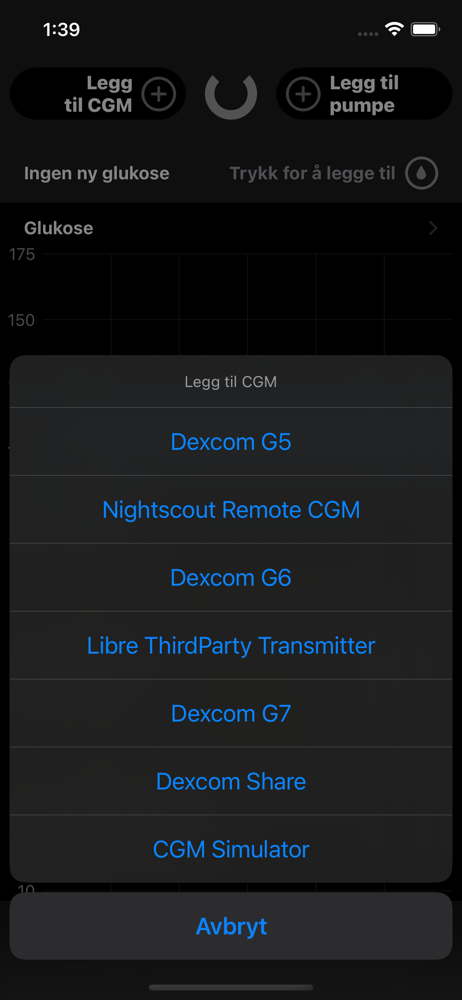
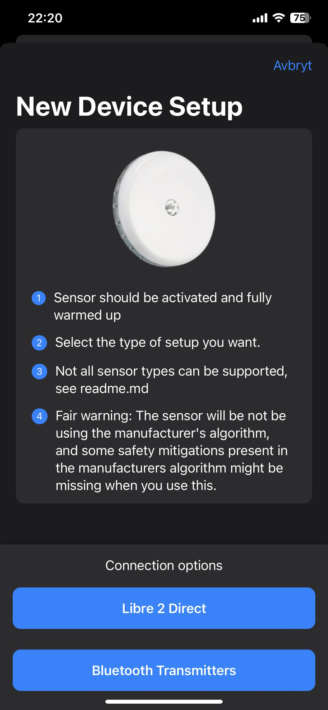
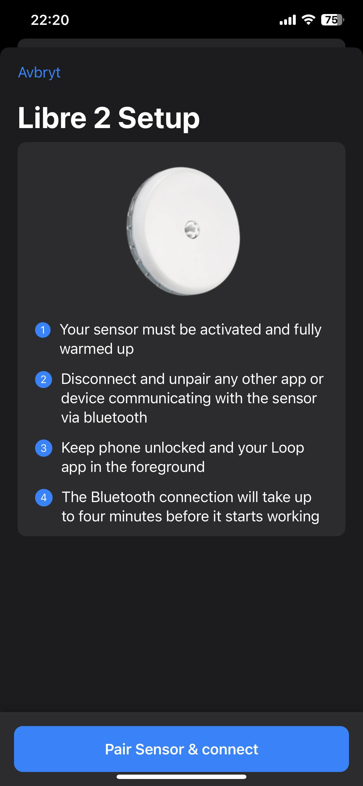
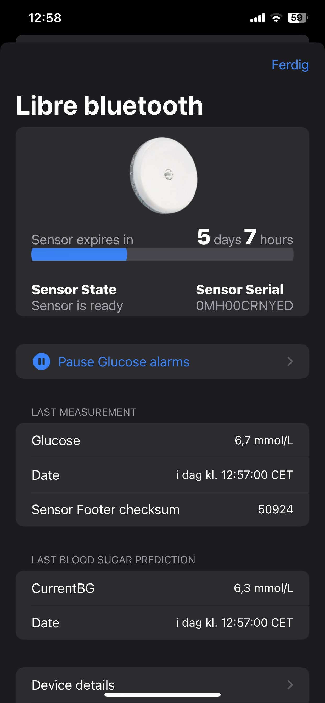
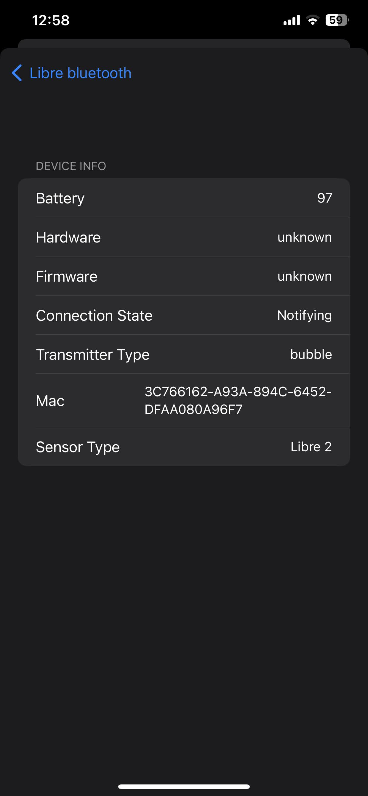

# LibreTransmitter for Loop
This is a https://github.com/loopkit/loop plugin for connecting to libresensors via miaomiao and bubble transmitters

# Supported sensors
* US Libre 1 10 day sensors (tested)
* US Libre 1 14 day sensors (untested)
* International Libre 1 sensors (tested)
* European Libre 2 sensors via Transmitters
* European Libre 2 directly via bluetooth

# Unsupported sensors
* US libre 2 sensors
* Libre Pro sensors
* Libre H sensors
* Libre 3 or any later generation

# Features
* Auto calibration, similar - but not identical - to the official algorithm
* Glucose values can be uploaded to nightscout automatically by Loop
* Optional: Backfill the last 16 minutes of data (recommend to turn off)
* Optional: Backfill the last 8 hours of data (15 minute cadence)
* Glucose data is smoothed to avoid noise, using a 5 point moving average filter
* Official algorithm implements glucose prediction, to align cgm values with blood values; this feature is deliberately removed from this implementation
* Glucose readout interval: 5 minutes
* Glucose alarms
* Glucose notifications on lockscreen
* Manual calibration for expert users (warnings apply here, this feature can be extremly dangerous)

# How it looks

      

# How to build
It's a dynamic loop plugin. I usually build a modified loopworkspace to get this working. See the [build.md](./build.md) file for futher instructions

## Glucose Algorithm
The GetGlucoseFromRaw.swift file is not included in this repo. You need to explicitly download this file from other sources and add it before you build

